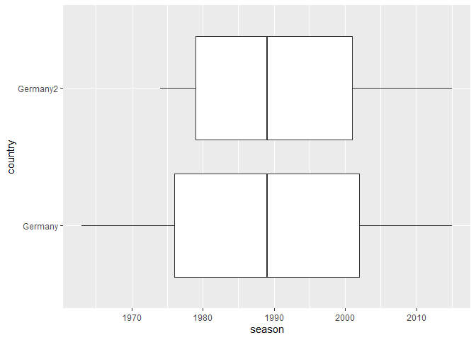

<!-- README.md is generated from README.Rmd. Please edit that file -->

# ussie

<!-- badges: start -->

[](https://github.com/cpenaloza/ussie/actions/workflows/R-CMD-check.yaml)
[](https://github.com/cpenaloza/ussie/actions/workflows/test-coverage.yaml)
<!-- badges: end -->

The goal of ussie is to explore the European League Football data back
from 1880 something.

## Installation

You can install the development version of ussie from
[GitHub](https://github.com/) with:

``` r
# install.packages("devtools")
devtools::install_github("cpenaloza/ussie")
```

## Example

This is a basic example which shows you how to solve a common problem:

``` r
library(ussie)
germany <- uss_make_matches(engsoccerdata::germany, "Germany")
germany2 <- uss_make_matches(engsoccerdata::germany2, "Germany2")
```

  
  

### What does our data look like?

``` r
dplyr::glimpse(germany)
#> Rows: 16,120
#> Columns: 8
#> $ country       <chr> "Germany", "Germany", "Germany", "Germany", "Germany", "~
#> $ tier          <fct> 1, 1, 1, 1, 1, 1, 1, 1, 1, 1, 1, 1, 1, 1, 1, 1, 1, 1, 1,~
#> $ season        <int> 1963, 1963, 1963, 1963, 1963, 1963, 1963, 1963, 1963, 19~
#> $ date          <date> 1963-08-24, 1963-08-24, 1963-08-24, 1963-08-24, 1963-08~
#> $ home          <chr> "Werder Bremen", "1. FC Saarbrucken", "TSV 1860 Munchen"~
#> $ visitor       <chr> "Borussia Dortmund", "1. FC Koln", "Eintracht Braunschwe~
#> $ goals_home    <int> 3, 0, 1, 1, 2, 1, 1, 1, 3, 4, 3, 4, 2, 2, 3, 1, 1, 0, 2,~
#> $ goals_visitor <int> 2, 2, 1, 1, 0, 1, 4, 1, 3, 2, 0, 0, 3, 0, 1, 0, 3, 4, 3,~
```

  
  

### Let’s plot that!

    #> Warning: package 'ggplot2' was built under R version 4.1.3



In that case, don’t forget to commit and push the resulting figure
files, so they display on GitHub and CRAN.
